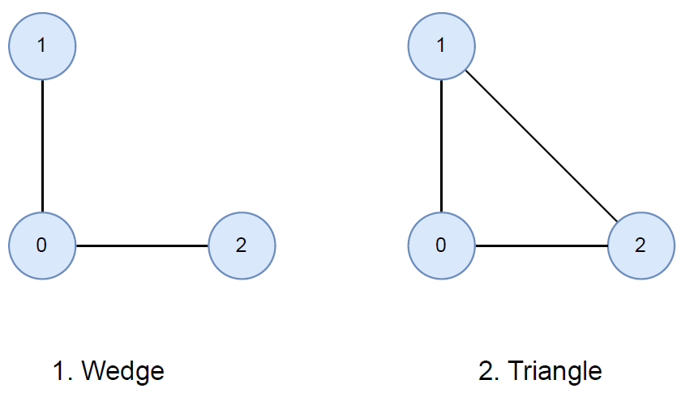
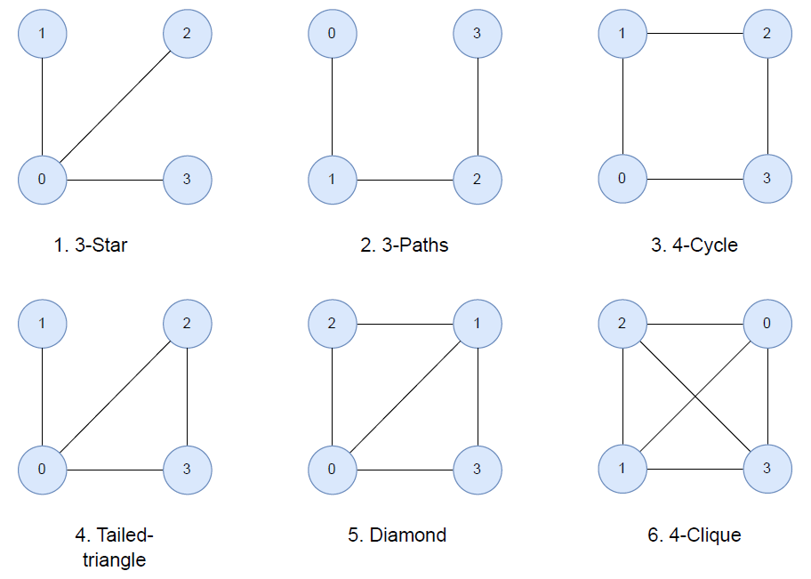
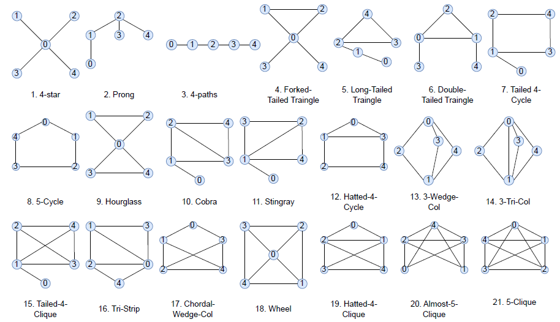

# CaTSCAN: Calculating Typed Subgraph Counts Analytically for Networks


CaTSCAN is an efficient algorithm for counting exact frequencies of typed graphlets of up to 5 nodes in heterogeneous information networks. It derives counts of larger graphlets from smaller ones using combinatorics, avoiding excessive enumeration while preserving type information, and outperforms existing typed graphlet solutions by up to 4 orders of magnitude.

This repository contains the code accompanying the paper:

> Christian Beth\*, Mattis thor Straten, Felix Rodriguez Rasmussen, Mohammad Matin Najafi, Reynold Cheng, and Matthias Renz. **CaTSCAN: Calculating Typed Subgraph Counts Analytically for Networks.** In *Proceedings of ECML PKDD 2026*. In press.
>
> \*Corresponding author: [Christian Beth](christianbeth.com)

It also includes our implementation of the algorithm for typed graphlets following the paper by [Rossi et al. (TKDD 2020)](https://doi.org/10.1145/3418773), which counts typed 3- and 4-node subgraphs, used as a reference implementation and baseline.

<br>

## Citation

```bibtex
@inproceedings{beth2026catscan,
  author    = {Beth, Christian
               and thor Straten, Mattis
               and Rodriguez Rasmussen, Felix
               and Najafi, Mohammad Matin
               and Cheng, Reynold
               and Renz, Matthias},
  title     = {{CaTSCAN}: Calculating Typed Subgraph Counts Analytically for Networks},
  booktitle = {Proceedings of the European Conference on Machine Learning and
               Principles and Practice of Knowledge Discovery in Databases
               (ECML PKDD)},
  year      = {2026},
  note      = {In press}
}
```

<br>


## Installation

1. Install your favorite IDE and clone this repository.
2. Install CMake:
   CMake is a cross-platform build system.
   Depending on your operating system, the installation process might vary:
   This is the process on Ubuntu:
   ```bash
   sudo apt-get install cmake
   ```
3. Build the project:
   ```bash
   ~/.../catscan$ cmake -S . -B build
   ~/.../catscan$ cd build
   ~/.../catscan/build$ make
   ```
4. Usage of our proposed solution (supports graphlet sizes 3, 4, and 5):
   ```bash
   ~/.../catscan/build$ cd ..
   ~/.../catscan$ ./build/CaTSCAN <dataset_dir> <output_dir> <size of graphlets>
   ```
5. Usage of our implementation of the algorithm by [Rossi et al.(https://dl.acm.org/doi/abs/10.1145/3418773)] (supports graphlet sizes 3 and 4):
   ```bash
   ~/.../catscan/build$ cd ..
   ~/.../catscan$ ./build/Rossi <dataset_dir> <output_dir> <size of graphlets>
   ```

<br>

## Input Format

The dataset directory for the desired graph should contain the following files:
- `meta.csv`: The first line contains the number of nodes, the second line the number of edges, and the third the number of node types.
- `nodes.csv`: Each line contains the type ID of the corresponding node (0-indexed, as integer). 
- `edges.csv`: Each line contains an edge in the form `<source node id>, <edge type id>, <target node id>` (where node ids are 0-indexed, as integers, and edge type id is also 0-indexed, as integer).
    The file should contain no multi-edges, self-loops, reverse edges, or dangling edges.
- `node_types.csv` (optional): Each line contains the type name (as string) of the corresponding node type ID (line 0 corresponds to node type 0).
- `edge_types.csv` (optional): Each line contains the type name (as string) of the corresponding edge type ID (line 0 corresponds to edge type 0).

An example dataset is provided in `catscan/data/DBLP4areas/`. To run CaTSCAN on it for 4-node graphlets:

```bash
~/.../catscan$ ./build/CaTSCAN data/DBLP4areas/ output/ 4
```

<br>

## Output Format

The directory will contain a file `CaTSCAN_times_<graphlet size>.tsv` or `Rossi_times_<graphlet size>.tsv`,
where each line contains the runtime (in milliseconds) to load the graph, and for the counting of all graphlets of the specified size, separated by a tab.
Please note that for each run a new line is appended instead of overwriting the file.

When running CaTSCAN (not for Rossi), the output directory will contain a file for each graphlet type, named `<graphlet name>.tsv`.
Each line contains a type description, e.g., `(3, 0, 1, 2, 3)` and, separated by a tab character, the count of occurrences of that typed graphlet in the input graph.
The type description is a tuple where each entry corresponds to a node type ID, where the type position is indicated by the graphlet figure.
For example, the line `(3, 0, 1, 2, 3) \t 42` in the output file `four_stars.tsv` would indicate that there are 42 occurrences of the 4-star where the center node has type ID 3, surrounded by nodes with type IDs 0, 1, and 2 respectively.

<br>

### Three-Node Graphlets



<br>

### Four-Node Graphlets



<br>

### Five-Node Graphlets


